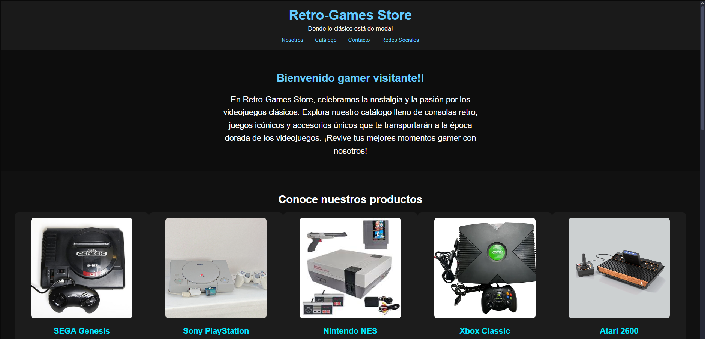

# 🎮 RetroGame Store – Proyecto Final del Módulo 1

Este proyecto es una página web básica creada únicamente con HTML, siguiendo los lineamientos del Proyecto Final del Módulo 1. La página presenta una tienda ficticia de videojuegos retro, con productos clásicos de Nintendo, Sega, PlayStation y Xbox.
El objetivo es demostrar el uso correcto de etiquetas semánticas, contenido estructurado y manejo básico de Git y GitHub.

---

## 🚀 Objetivo del Proyecto

Construir y publicar una página web estática desde cero demostrando dominio de:

- HTML semántico  
- Organización visual a través de títulos, párrafos e imágenes  
- Enlaces internos y externos  
- Formularios, listas y navegación  
- Buenas prácticas de estructura  
- Uso de Git y GitHub para control de versiones  
- Publicación con GitHub Pages

---

## 🕹️ RetroGame Store

Mi página está basada en una **tienda de videojuegos retro**, donde presento:
- Información sobre la tienda  
- Una barra de navegación  
- Una sección de productos  
- Tarjetas con videojuegos clásicos de **Sega, PlayStation, Xbox y Nintendo**  
- Un formulario de contacto  
- Imágenes relevantes y enlaces externos  

---

## 📂 Estructura del Proyecto

El repositorio contiene:

```
├── index.html # Página principal del proyecto
├── styles.css # Hoja de estilos del proyecto (aunque no se usó)
├── main.js # Archivo de JavaScript del proyecto (aunque no se usó)
├── /assets # Carpeta con un screeshot de la visualización del proyecto
└──README.md # Explicación del proyecto 
```
---

## 🔧 Tecnologías Utilizadas

- **HTML5**  
- **Git & GitHub**  
- **GitHub Pages**

---

## 🌐 Publicación

Mi proyecto está publicado en GitHub Pages y puedes verlo aquí:

👉 **URL del Proyecto:**  
https://ettijoseangel.github.io/proyecto_final_modulo1.github.io/

👉 **Repositorio en GitHub:**  
https://github.com/ettijoseangel/proyecto_final_modulo1.github.io

---
## 📝 Características Implementadas

- Uso correcto de `<html>`, `<head>`, `<body>`, `<title>`, `<meta>`
- Navegación interna con `<nav>` y `<a>`
- Secciones organizadas con `<header>`, `<main>`, `<section>`, `<article>` y `<footer>`
- Uso de títulos `<h1>`, `<h2>`, `<h3>`
- Imágenes de videojuegos retro
- Listas organizadas `<ul>` y `<ol>`
- Formulario con las etiquetas `<form>`, `<input>`, `<label>`
- 5 tarjetas de productos con estilo propio
- Estilos aplicados en línea
- Versionado con Git (commits progresivos)

---
## 🖼️ Screenshot



---
## 🚀 Despliegue en GitHub Pages

1. Para desplegar una página web, tenemos que asegurarnos de que el archivo principal sea **index.html**.  
2. Subimos el proyecto al repositorio en GitHub.  
3. En GitHub vamos a **Settings → Pages**.  
4. En **Build and Deployment**, seleccionamos:  
   - **Source:** Deploy from a branch  
   - **Branch:** main / root  
5. Guardamos los cambios.  
6. Esperamos unos segundos mientras se genera el sitio.  
7. Copiamos la URL pública que aparece en la sección de GitHub Pages.
